# CI/CD Documentation

Naming conventions for GitHub Actions:
- `workflow-*.yml`: Reusable workflows
- `ci-cd-*.yml`: Workflows that are triggered by an event
- `dispatch-*.yml`: Workflows that are dispatchable

## CI/CD Flow

### 1. Development & Merge Process

1. **Development**
   - Create feature branch from `main`
   - Follow branch naming convention: `(feat|fix|docs|test|ci|chore|trivial)!?(\\(.*\\))?!?:.*`
   - Create PR against `main`
   - PR title must follow conventional commits format (validated by `ci-cd-pull-request-title.yml`)
   - Get code review and approval
   - Merge to `main`

2. **Main Branch Triggers**  
When code is merged to `main`, two parallel workflows are triggered:

   a. **CI/CD Main** (`ci-cd-main.yml`)
   - Automatically deploys to Test environment
   - Runs full deployment including:
     - Infrastructure if changed
     - Applications if changed
     - Runs tests
     - Updates dependencies

   b. **Release Please** (`ci-cd-release-please.yml`)
   - Checks if changes warrant a new release
   - Either:
     - Creates/updates release PR, or
     - Builds and publishes Docker images if release is complete

### 2. Release & Deployment Flow

#### When Release is Created/Published:
Three parallel workflows are triggered:

1. **Production Dry Run** (`ci-cd-prod-dry-run.yml`)
   - Validates production deployment configuration
   - No actual deployment
   - Early warning for potential production issues

2. **Staging Deployment** (`ci-cd-staging.yml`)
   - Deploys to staging (tt02) environment
   - Full deployment including:
     - Infrastructure updates
     - Application deployment
     - Database migrations
     - SDK publishing
     - End-to-end testing

3. **YT01 Deployment** (`ci-cd-yt01.yml`)
   - Deploys to YT01 environment
   - Performance testing environment
   - Full deployment similar to staging

#### Production Deployment
- **Manual Trigger Required** (`ci-cd-prod.yml`)
- Requires specific version input
- Full deployment process:
  - Version verification
  - Infrastructure deployment
  - Application deployment
  - Node logger publishing
  - Version tracking updates

### 3. Environment Flow
```
Development → Main Branch → Test → [YT01 + Staging] → Production
                           ↑         ↑                  ↑
                    Auto deploy    Auto deploy    Manual deploy
                    on merge       on release      with version
```

### 4. Environment Purposes

- **Test**: Automatic deployment target for all changes merged to main
- **YT01**: Performance test environment, automatically updated with releases
- **Staging (tt02)**: Pre-production verification, automatically updated with releases
- **Production**: Production environment, requires manual deployment trigger

### 5. Manual Control Options

Available manual workflows for all environments:
- `dispatch-infrastructure.yml`: Infrastructure deployment
- `dispatch-apps.yml`: Application deployment

#### Using `dispatch-apps.yml`

The `dispatch-apps.yml` workflow is responsible for deploying applications. To trigger this workflow:

1. Navigate to the Actions tab in the GitHub repository.
2. Select the `Dispatch Apps` workflow.
3. Click on "Run workflow".
4. Fill in the required inputs:
   - **environment**: Choose the target environment (`test`, `yt01`, `staging`, or `prod`).
   - **version**: Specify the version to deploy. Could be git tag or a docker-tag published in packages.
   - **runMigration** (optional): Indicate whether to run database migrations (`true` or `false`).

This workflow will handle the deployment of applications based on the specified parameters, ensuring that the correct version is deployed to the chosen environment.

#### Using `dispatch-infrastructure.yml`

The `dispatch-infrastructure.yml` workflow is used for deploying infrastructure components. To use this workflow:

1. Go to the Actions tab in the GitHub repository.
2. Select the `Dispatch Infrastructure` workflow.
3. Click on "Run workflow".
4. Provide the necessary inputs:
   - **environment**: Select the environment you wish to deploy to (`test`, `yt01`, `staging`, or `prod`).
   - **version**: Enter the version to deploy, which should correspond to a git tag. (e.g., `1.23.4`).

This workflow facilitates the deployment of infrastructure to the specified environment, using the version details provided.


### 6. Version Management

- Release-please manages versioning based on conventional commits
- Versions are tracked in GitHub environment variables
- Separate tracking for infrastructure and applications
- Docker images tagged with release versions
- SDK and schema packages versioned with releases

[Release Please](https://github.com/googleapis/release-please-action) is used to create releases, generate changelog and bumping version numbers.

`CHANGELOG.md` and `version.txt` are automatically updated and should not be changed manually.

### 7. Deployment Lag Monitoring

To ensure timely production deployments and maintain deployment cadence, an automated deployment lag monitoring system tracks when production deployments are falling behind staging deployments.

#### How It Works
- **Automatic Monitoring**: Runs daily at 9:00 AM UTC (11:00 AM CET)
- **Manual Trigger**: Can be triggered manually via GitHub Actions
- **Slack Notifications**: Sends alerts when production is significantly behind staging

#### Notification Triggers
A Slack notification is sent when any of these conditions are met:
- More than 2 days since last production deployment AND more than 1 release behind
- More than 7 days since last production deployment (regardless of release count)  
- More than 5 releases behind (regardless of time)

#### Severity Levels
- 🟢 **LOW**: < 7 days AND < 5 releases behind
- 🟡 **MEDIUM**: 7-14 days OR 5-10 releases behind
- 🔴 **HIGH**: > 14 days OR > 10 releases behind

#### Notification Details
Slack notifications include:
- Current staging and production versions
- Number of releases production is behind
- Days since last production deployment
- Recent commits not yet in production
- Quick action buttons for viewing differences and deploying

For detailed configuration and customization options, see [Deployment Lag Monitoring Documentation](../../../docs/DeploymentLagMonitoring.md).

### 8. Visual Workflow


