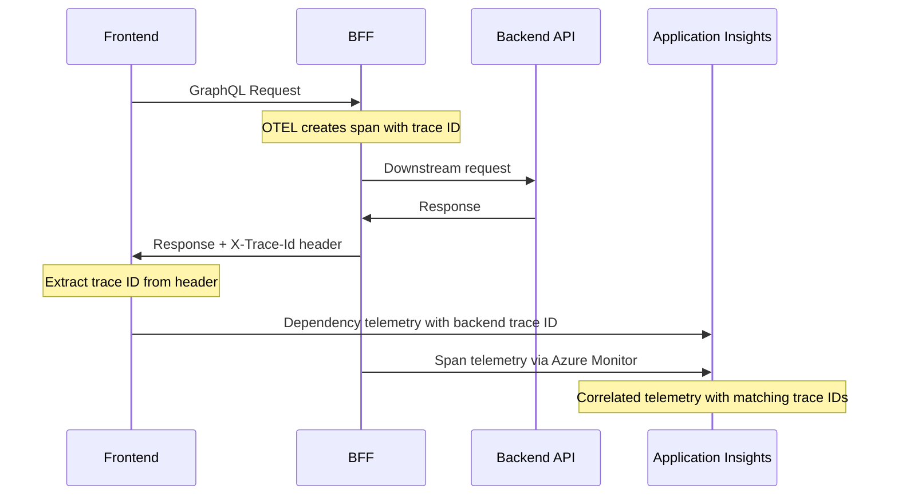

# Observability and Instrumentation

This document describes the observability setup for the Dialogporten Frontend application, covering both the Backend-for-Frontend (BFF) and Frontend instrumentation.

## Overview

The application uses a hybrid approach to observability:
- **BFF**: OpenTelemetry (OTEL) with Azure Monitor exporter
- **Frontend**: Application Insights SDK directly

Both components are configured to work together, providing end-to-end tracing correlation through trace IDs.

## Backend-for-Frontend (BFF) Instrumentation

### Technology Stack
- **OpenTelemetry SDK**: Core instrumentation framework
- **Azure Monitor Exporter**: Sends telemetry data to Application Insights
- **Custom Instrumentations**: Additional OTEL instrumentations for specific libraries

### Configuration

The BFF uses OpenTelemetry with the Azure Monitor exporter configured in `packages/bff/src/instrumentation.ts`:

```typescript
import { useAzureMonitor } from '@azure/monitor-opentelemetry';
import { registerInstrumentations } from '@opentelemetry/instrumentation';
```

#### Key Features:
1. **Azure Monitor Integration**: Direct export to Application Insights
2. **Resource Attribution**: Custom service name and instance ID
3. **Multi-Library Support**: HTTP, GraphQL, Redis, and Fastify instrumentation
4. **Trace ID Propagation**: Adds `X-Trace-Id` header to all responses

#### Enabled Instrumentations:
- **HTTP Instrumentation**: Tracks incoming/outgoing HTTP requests
- **GraphQL Instrumentation**: Monitors GraphQL operations with span merging
- **IORedis Instrumentation**: Tracks Redis operations
- **Fastify OTEL Instrumentation**: Framework-specific instrumentation
- **PostgreSQL Instrumentation**: Database query tracking (via Azure Monitor)

#### Filtering and Optimization:
- **Health Check Filtering**: Excludes `/api/liveness` and `/api/readiness` endpoints
- **OPTIONS Request Filtering**: Ignores CORS preflight requests
- **GraphQL Optimization**: Ignores trivial resolver spans and merges related spans

### Trace ID Propagation

The BFF automatically adds trace IDs to response headers:

```typescript
// In fastifyHeaders.ts
const currentSpan = trace.getActiveSpan();
if (currentSpan?.spanContext().traceId) {
  const traceId = currentSpan.spanContext().traceId;
  reply.header('X-Trace-Id', traceId);
}
```

This enables correlation with frontend telemetry.

## Frontend Instrumentation

### Technology Stack
- **Application Insights Web SDK**: Direct integration with Azure Application Insights
- **React Plugin**: React-specific instrumentation
- **Manual Dependency Tracking**: Custom fetch/XHR tracking

### Configuration

The frontend uses Application Insights SDK directly, configured in `packages/frontend/src/analytics.ts`:

```typescript
import { ApplicationInsights } from '@microsoft/applicationinsights-web';
import { ReactPlugin } from '@microsoft/applicationinsights-react-js';
```

#### Key Features:
1. **React Integration**: Automatic component lifecycle tracking
2. **Route Tracking**: Automatic page view tracking
3. **Error Handling**: Unhandled promise rejection tracking
4. **CORS Correlation**: Cross-origin request correlation
5. **Manual Dependency Tracking**: Custom fetch tracking with backend correlation

#### Configuration Highlights:
- **Disabled Automatic Tracking**: `disableAjaxTracking: true, disableFetchTracking: true`
- **Enhanced Correlation**: `enableCorsCorrelation: true`
- **Debug Mode**: `enableDebug: true` for development
- **Custom Sampling**: Configurable sampling percentage

### Trace Correlation

The frontend correlates with backend traces through the `trackFetchDependency` function:

```typescript
export const trackFetchDependency = async (url: string, options: RequestInit = {}) => {
  // ... request execution ...
  
  // Extract backend trace ID from response
  backendTraceId = response.headers.get('X-Trace-Id') || backendTraceId;
  
  // Track dependency with correlation
  Analytics.trackDependency({
    id: backendTraceId || `${Date.now()}`, // Use backend trace ID when available
    properties: {
      'backend.traceId': backendTraceId,
      'correlation.source': 'frontend',
      'request.type': 'graphql',
      'timing.correctionFlag': 'true'
    }
  });
};
```

### Error Filtering

The frontend implements intelligent error filtering to reduce noise:

- **Browser Extension Errors**: Filters out errors from browser extensions
- **Cross-Origin Errors**: Excludes generic "Script error" messages
- **Stack Trace Analysis**: Examines parsed stack traces for extension URLs

## End-to-End Correlation Flow



## Environment Configuration

### BFF Environment Variables
```bash
# Application Insights connection string
APPLICATION_INSIGHTS_CONNECTION_STRING="InstrumentationKey=..."

# Enable/disable instrumentation
APPLICATION_INSIGHTS_ENABLED=true
```

### Frontend Configuration
The frontend receives its instrumentation key through a global variable. For details on how to add new environment variables, see the [Environment Variables](./environment+variables.md) documentation.

## Monitoring and Debugging

### Key Metrics to Monitor
1. **Request Duration**: End-to-end request timing
2. **Error Rates**: Application and dependency errors
3. **Dependency Failures**: Backend API failures
4. **GraphQL Operations**: Query/mutation performance
5. **Database Performance**: PostgreSQL query timing
6. **Redis Performance**: Cache operation timing

### Debugging Tips
1. **Trace ID Correlation**: Use `X-Trace-Id` header to correlate frontend and backend logs
2. **Debug Mode**: Enable debug mode in development for detailed telemetry logs
3. **Sampling**: Adjust sampling percentage for development vs. production
