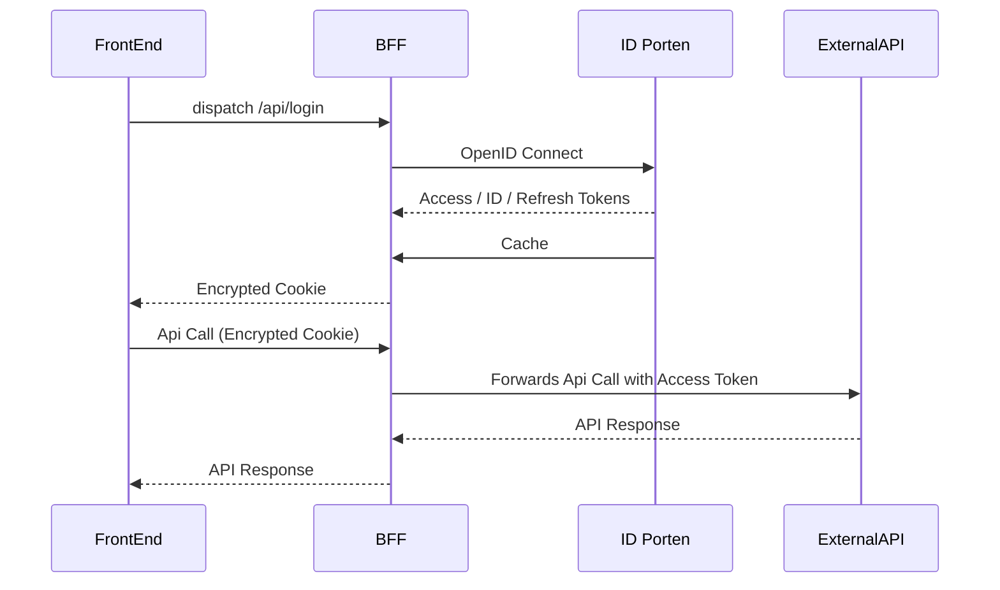

# ID Porten

## Login and session management

Our app needs to connect to id-porten

<a href='https://docs.digdir.no/docs/idporten/oidc/oidc_func_clientreg.html#metadata-for-klienter-som-konsumerer-apier'>Cf. Doc for more information</a>

## Logout and front-channel logout

Logout is done by calling the logout endpoint on id-porten with id token as hint, and a successful logout will redirect to the logged out route on our app.

Our app also supports a route for front-channel logout, which all apps within the circle-of-trust are required to have.
This route destroys the session, provided current session id from id-porten.

