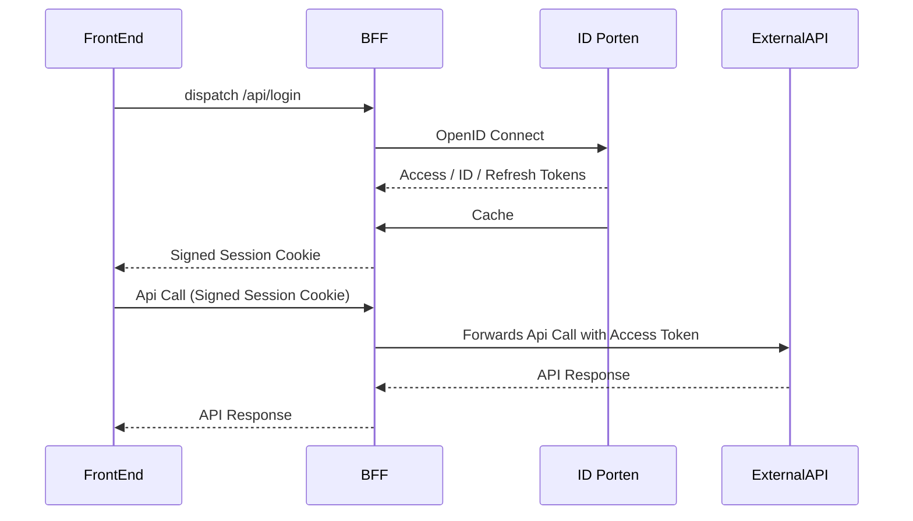

## Login and session management

The BFF uses the configured OIDC provider for login and keeps tokens in Redis. The browser receives a signed, opaque session ID in a Secure, HttpOnly, SameSite=Lax cookie. Successful login rotates the session ID and removes the previous session and its login challenge state.

<a href='https://docs.digdir.no/docs/idporten/oidc/oidc_func_clientreg.html#metadata-for-klienter-som-konsumerer-apier'>Cf. Doc for more information</a>

## Logout and front-channel logout

Logout is done by calling the logout endpoint on id-porten with id token as hint, and a successful logout will redirect to the logged out route on our app.

Our app also supports a route for front-channel logout, which all apps within the circle-of-trust are required to have.
This route checks the issuer and revokes all indexed BFF sessions for the provider's session ID. Legacy single-session indexes remain supported during rollout. Revoked sessions cannot be recreated by delayed writes, even after the short revocation marker expires. Local logout also destroys sessions without an ID token and clears the browser cookie.

Protected API requests return HTTP 401 before running a handler when the access token is missing or expired. `/api/isAuthenticated` can refresh tokens; ordinary GraphQL requests keep the existing separate refresh flow. Redis session expiry is capped by the remaining access/refresh-token lifetime. Redis telemetry records command names only, because Lua arguments contain session credentials.

Run `pnpm --filter bff test:integration` for the Redis-backed login, logout, expiry and revocation regressions. The suite uses Docker, or isolated `TEST_REDIS_URL` and `TEST_DATABASE_URL` services.

